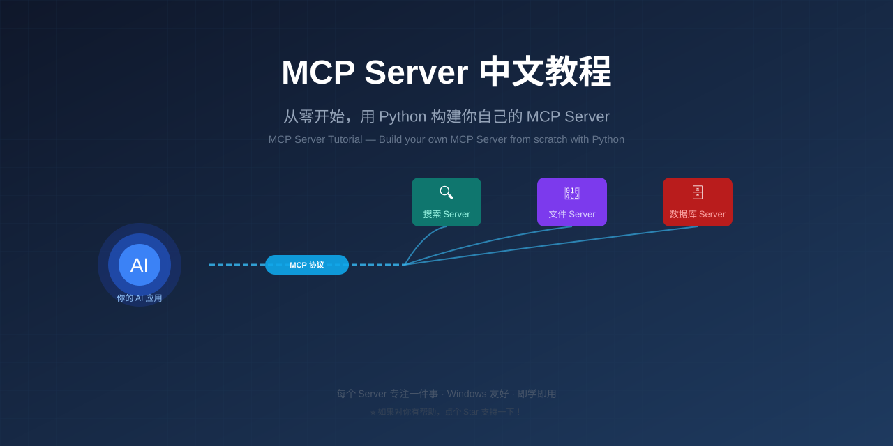

<p align="center">
  
</p>

<h1 align="center">MCP Server 中文教程</h1>
<h3 align="center">从零开始，用 Python 构建你自己的 MCP Server</h3>

<p align="center">
  <em>MCP Server Tutorial in Chinese — Build your own MCP Server from scratch with Python.</em>
</p>

<div align="center">


**让 AI 能调用你的工具、读取你的数据——用 MCP 协议。**

</div>

## 📖 这是什么

**MCP (Model Context Protocol)** 是 Anthropic 提出的开放协议，统一了 AI 应用与外部工具/数据源的交互方式。简单说：**给你的 AI 接上"外挂"**。

本教程是用**中文 + 可运行代码**教你写 MCP Server，面向初学者：

- **有真实代码**：基于你已有的 MCP Server 实战经验提炼
- **Windows 友好**：不用装 Docker，不用 WSL，原生 Windows 就能跑
- **即学即用**：每个例子都能在 5 分钟内跑起来

## 📚 目录

| 章节 | 内容 | 适合谁 |
|------|------|--------|
| [01 - 认识 MCP](./01-认识MCP/README.md) | 什么是 MCP？架构、为什么用、对比 API | 完全新手 |
| [02 - 快速开始](./02-快速开始/README.md) | 搭环境、写第一个 Hello World Server | 想动手 |
| [03 - 核心概念](./03-核心概念/README.md) | Tool / Resource / Prompt 详解 | 想深入 |
| [04 - 实战案例](./04-实战案例/README.md) | 文件读写、网络搜索等真实 Server | 要实战 |
| [05 - 注册与配置](./05-注册与配置/README.md) | 接入 Claude / Cherry Studio 等客户端 | 要部署 |
| [06 - 常见坑与技巧](./06-常见坑与技巧/README.md) | Windows 路径、编码、调试排错 | 遇到问题 |

## 🚦 快速上手

```bash
# 1. 装 Python 依赖
pip install "mcp[cli]"

# 2. 写一个最简单的 Server
echo 'from mcp.server.fastmcp import FastMCP
mcp = FastMCP("你好世界")

@mcp.tool()
def hello(name: str) -> str:
    return f"你好, {name}!"

if __name__ == "__main__":
    mcp.run(transport="stdio")' > hello_server.py

# 3. 用 MCP Inspector 调试
mcp dev hello_server.py

# 4. 配置到你的 AI 客户端——详见 [05 注册与配置](./05-注册与配置/README.md)
```

## ✨ 本教程的亮点

- **中文**：目前 MCP 中文教程极度稀缺，这份教程填补空白
- **Windows 实战经验**：路径/编码/注册等踩坑记录，不是 Mac-only 的理想教程
- **代码即文档**：每个概念配完整可运行代码
- **聚焦 stdio 模式**：本地开发最常用场景，不跑偏到分布式

## 🤝 贡献

有补充、纠错、新案例？欢迎提 Issue 或 PR！

---

> 🤖 本教程由 AI 辅助整理，代码均经过实测。
>
> ⭐ 如果对你有帮助，点个 Star 支持一下！